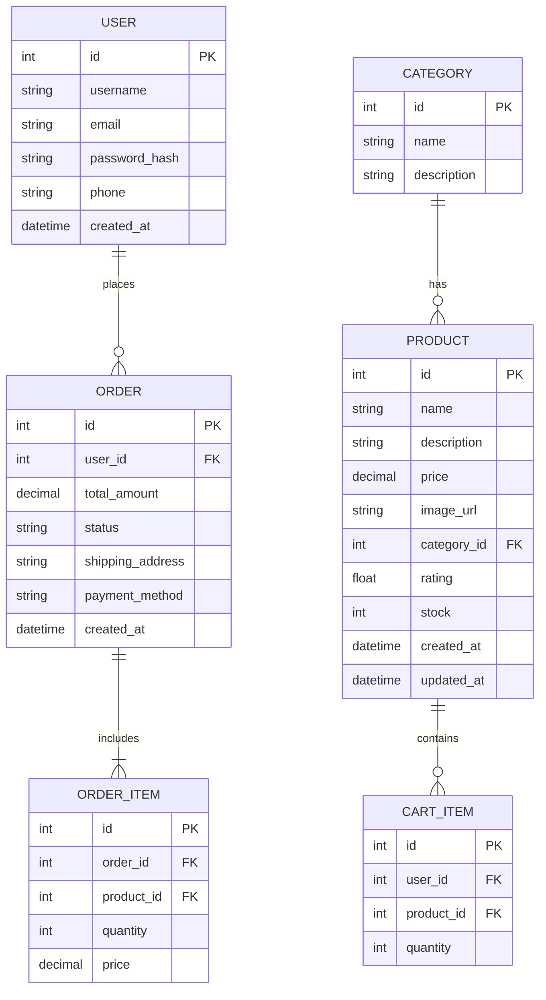

## 1. 架构设计

```mermaid
graph TD
    subgraph "前端层"
        A["React 电商平台"]
        B["React Router"]
        C["状态管理"]
    end
    
    subgraph "API层"
        D["Node.js API Server"]
    end
    
    subgraph "消息队列层"
        E["Kafka (localhost:9092)"]
        E1["ecommerce-events Topic"]
        E2["ecommerce-orders Topic"]
    end
    
    subgraph "数据采集层"
        F["Flume Agent"]
    end
    
    subgraph "数据存储层"
        G["MySQL (3307)"]
        H["HDFS (localhost:9000)"]
    end
    
    A --&gt; D
    D --&gt; E
    D --&gt; G
    E --&gt; F
    F --&gt; H
    G --&gt; F
```

## 2. 技术描述

* **前端框架**：React\@18 + TypeScript

* **构建工具**：Vite\@5

* **样式方案**：Tailwind CSS\@3

* **路由管理**：React Router DOM\@6

* **状态管理**：React Context API

* **后端框架**：Express.js\@4

* **消息队列**：Apache Kafka\@3.9.2

* **数据采集**：Apache Flume\@1.11.0

* **关系型数据库**：MySQL@端口3307

* **分布式存储**：Hadoop HDFS\@3.3.6

* **Kafka客户端**：kafka-python

## 3. 系统数据流架构

### 3.1 电商平台数据流

```
用户操作 → React前端 → Express API → Kafka Topic → Flume → HDFS
                    ↓
                  MySQL (实时数据)
```

### 3.2 实时事件流程

1. \*\*用户行为数据 → Kafka `ecommerce-events` Topic
2. \*\*订单数据 → Kafka `ecommerce-orders` Topic
3. \*\*商品更新 → MySQL 实时查询
4. \*\*日志数据 → Flume → HDFS 长期存储

## 4. 路由定义

| 路由路径            | 页面组件              | 功能说明             |
| --------------- | ----------------- | ---------------- |
| /               | HomePage          | 首页，展示轮播图、分类、热门商品 |
| /products       | ProductsPage      | 商品列表页，支持筛选和排序    |
| /products/:id   | ProductDetailPage | 商品详情页            |
| /cart           | CartPage          | 购物车页面            |
| /checkout       | CheckoutPage      | 订单确认页            |
| /order-success  | OrderSuccessPage  | 订单成功页            |
| /account        | AccountPage       | 用户中心             |
| /account/orders | OrdersPage        | 订单管理页            |
| /admin          | AdminDashboard    | 管理后台首页           |
| /api/products   | API               | 获取商品列表           |
| /api/orders     | API               | 创建订单             |
| /api/events     | API               | 用户行为事件           |

## 5. 数据模型

### 5.1 数据库表结构



### 5.2 TypeScript 类型定义

```typescript
interface Product {
  id: number;
  name: string;
  description: string;
  price: number;
  imageUrl: string;
  categoryId: number;
  rating: number;
  stock: number;
  createdAt: string;
  updatedAt: string;
}

interface Category {
  id: number;
  name: string;
  description: string;
}

interface User {
  id: number;
  username: string;
  email: string;
  phone: string;
}

interface CartItem {
  id?: number;
  productId: number;
  quantity: number;
  product?: Product;
}

interface Order {
  id: number;
  userId: number;
  totalAmount: number;
  status: 'pending' | 'processing' | 'shipped' | 'delivered';
  shippingAddress: string;
  paymentMethod: string;
  createdAt: string;
  items: OrderItem[];
}

interface OrderItem {
  id: number;
  orderId: number;
  productId: number;
  quantity: number;
  price: number;
  productName?: string;
  productImage?: string;
}

interface EcommerceEvent {
  eventType: 'page_view' | 'product_view' | 'add_to_cart' | 'checkout_start' | 'order_complete';
  userId?: number;
  productId?: number;
  timestamp: string;
  metadata?: any;
}
```

## 6. 项目结构

```
ecommerce-platform/
├── public/
├── src/
│   ├── components/
│   │   ├── ui/
│   │   │   ├── Button.tsx
│   │   │   ├── Card.tsx
│   │   │   └── Input.tsx
│   │   ├── layout/
│   │   │   ├── Navbar.tsx
│   │   │   └── Footer.tsx
│   │   └── features/
│   │       ├── ProductCard.tsx
│   │       ├── CartItem.tsx
│   │       └── Carousel.tsx
│   ├── pages/
│   │   ├── HomePage.tsx
│   │   ├── ProductsPage.tsx
│   │   ├── ProductDetailPage.tsx
│   │   ├── CartPage.tsx
│   │   ├── CheckoutPage.tsx
│   │   ├── OrderSuccessPage.tsx
│   │   ├── AccountPage.tsx
│   │   └── AdminDashboard.tsx
│   ├── context/
│   │   ├── CartContext.tsx
│   │   └── ProductContext.tsx
│   ├── types/
│   │   └── index.ts
│   ├── utils/
│   │   └── api.ts
│   ├── App.tsx
│   ├── main.tsx
│   └── index.css
├── api/
│   ├── server.ts
│   ├── routes/
│   │   ├── products.ts
│   │   ├── orders.ts
│   │   └── events.ts
│   ├── services/
│   │   ├── kafka.ts
│   │   └── mysql.ts
│   └── types/
│       └── index.ts
├── sql/
│   └── schema.sql
├── flume-conf/
│   └── ecommerce.conf
├── package.json
├── vite.config.ts
├── tailwind.config.js
└── tsconfig.json
```

## 7. Kafka 配置

| Topic 名称         | 用途     | 分区数 | 副本数 |
| ---------------- | ------ | --- | --- |
| ecommerce-events | 用户行为事件 | 3   | 1   |
| ecommerce-orders | 订单数据   | 3   | 1   |

## 8. Flume 配置

Source: Exec Source / Spool Dir / Kafka Source
Channel: Memory Channel
Sink: HDFS Sink / Kafka Sink

## 9. 核心功能实现策略

### 9.1 状态管理

* 使用 React Context API 管理购物车状态

* 后端使用 Express.js 提供 REST API

* 订单和用户行为事件发送到 Kafka

### 9.2 数据持久化

* 商品、订单、用户数据存储在 MySQL

* 事件日志通过 Flume 采集到 HDFS

* 购物车使用 LocalStorage 临时存储

### 9.3 实时数据流

1. 前端发送用户操作 → API 接收
2. API 写入 MySQL（关键数据）
3. API 发送到 Kafka（事件数据）
4. Flume 消费 Kafka → 写入 HDFS

