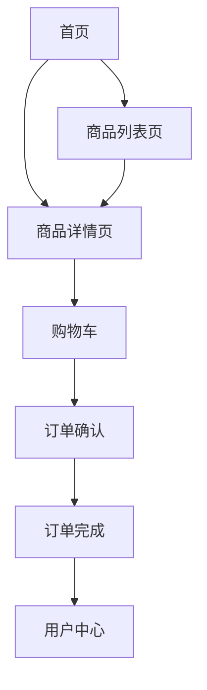

## 1. 产品概述
构建一个功能齐备的现代化电商平台，提供商品浏览、搜索、购物车、订单管理等核心功能，为用户提供便捷的在线购物体验。

- 面向广大消费者，解决传统购物时间成本高、选择有限等问题
- 打造美观、易用的电商解决方案，具备良好的用户体验和视觉设计

## 2. 核心功能

### 2.1 用户角色
| 角色 | 注册方式 | 核心权限 |
|------|----------|----------|
| 普通用户 | 邮箱/手机号码注册 | 浏览商品、添加购物车、下单购买、查看订单 |
| 管理员 | 后台登录 | 商品管理、订单管理、用户管理 |

### 2.2 功能模块
1. **首页**：导航栏、轮播图、商品分类、热门商品推荐
2. **商品列表页**：商品筛选、排序、商品卡片展示
3. **商品详情页**：商品图片轮播、详细信息、规格选择、加入购物车
4. **购物车页面**：商品列表、数量调整、价格计算、结算
5. **订单确认页**：收货地址、支付方式选择、订单预览
6. **用户中心**：个人信息、订单管理、收货地址管理
7. **管理员后台**：商品CRUD、订单管理、数据统计

### 2.3 页面详情
| 页面名称 | 模块名称 | 功能描述 |
|----------|----------|----------|
| 首页 | 导航栏 | Logo、分类菜单、搜索框、购物车图标、用户中心入口 |
| 首页 | 轮播图 | 自动播放商品促销图片，支持手动切换 |
| 首页 | 分类导航 | 点击分类跳转到对应商品列表页 |
| 首页 | 热门推荐 | 展示精选热门商品卡片 |
| 商品列表页 | 筛选器 | 按价格、品牌、分类等筛选商品 |
| 商品列表页 | 商品卡片 | 展示商品图片、名称、价格、评分 |
| 商品详情页 | 图片轮播 | 展示商品多角度图片 |
| 商品详情页 | 商品信息 | 商品描述、规格选择、库存显示 |
| 购物车页 | 商品管理 | 删除商品、调整数量、全选/取消全选 |
| 购物车页 | 价格汇总 | 小计、运费、总价计算 |
| 用户中心 | 订单管理 | 订单列表、订单状态、订单详情 |

## 3. 核心流程

用户浏览商品 → 选择心仪商品 → 加入购物车 → 进入购物车确认 → 填写收货信息 → 选择支付方式 → 提交订单 → 订单完成

## 4. 用户界面设计

### 4.1 设计风格
- **主色调**：深蓝色(#1e40af)作为主色，代表信任和专业
- **辅助色**：橙色(#f97316)作为强调色，用于按钮和促销元素
- **背景色**：浅灰(#f8fafc)与白色交替使用，营造层次感
- **按钮风格**：圆角矩形，轻微阴影，悬停时有渐变效果
- **字体**：使用 Noto Sans SC 作为中文字体，Inter 作为英文字体
- **布局风格**：卡片式设计，网格布局，清晰的视觉层次
- **图标**：使用线性图标风格，简洁现代

### 4.2 页面设计概述
| 页面名称 | 模块名称 | UI 元素 |
|----------|----------|---------|
| 首页 | 导航栏 | 固定顶部，深色背景，白色文字，渐变 Logo |
| 首页 | 轮播图 | 大尺寸图片，平滑过渡动画，指示器和导航按钮 |
| 首页 | 商品卡片 | 白色卡片，轻微阴影，圆角，悬停上浮效果 |
| 商品详情页 | 商品展示 | 左右分栏布局，左图右文，清晰对比 |
| 购物车页 | 购物车项 | 商品缩略图、名称、价格、数量调整器、删除按钮 |
| 用户中心 | 侧边菜单 | 垂直导航，激活项高亮 |

### 4.3 响应式设计
- 桌面端优先设计，同时完美适配平板和手机设备
- 使用响应式网格系统和弹性布局
- 触摸设备优化：增大点击区域，优化手势操作
- 在小屏幕设备上优化导航为汉堡菜单

### 4.4 动效设计
- 页面加载时的渐进式内容显现
- 商品卡片悬停时的轻微上浮和阴影加深
- 购物车添加时的动画反馈
- 按钮点击时的波纹效果
- 页面切换时的平滑过渡
